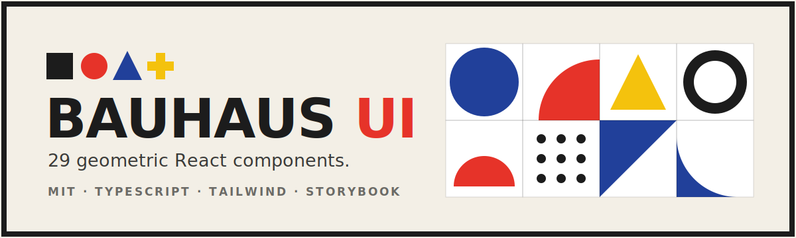

<p align="center">
  
</p>

# Bauhaus UI

A bold, geometric React component library inspired by the **Bauhaus** movement: primary
colors, hard edges, thick black borders, and a relentless grid. 29 components, fully typed,
accessible, themeable, with a built-in dark mode.

> Form follows function.

Built with **React + TypeScript + Tailwind CSS + Vite + Storybook**.

**[Live demo](https://xhu96.github.io/bauhaus-ui-library/)** · **[Storybook](https://xhu96.github.io/bauhaus-ui-library/storybook/)**

---

## Features

- **29 components** across forms, feedback, navigation, overlays, plus signature geometric primitives.
- **Bauhaus design system.** A disciplined palette (red `#E63329`, blue `#21409A`, yellow `#F4C20D`, ink `#1C1C1C`), geometric sans-serif type (Space Grotesk + Archivo), sharp corners and hard offset shadows.
- **Signature generator.** `GeometricPattern` tessellates deterministic Bauhaus motif grids for heroes and backdrops.
- **Dark mode** built in. Flip a single `.dark` class on `<html>`; surfaces and ink invert while the primary triad stays vivid.
- **Accessible.** Roles, ARIA attributes and keyboard support throughout (tabs, accordion, modal, toast).
- **Themeable.** Every surface token is a CSS variable; primaries are Tailwind colors.
- **Tree-shakeable** ESM + UMD builds with bundled type declarations.

## Installation

```bash
npm install bauhaus-ui-library
```

Import the stylesheet once at your app root:

```tsx
import 'bauhaus-ui-library/styles.css'
```

If you use Tailwind, make sure the Bauhaus theme tokens are available by extending your
config from `tailwind.config.js` (colors, fonts, shadows, animations).

Load the fonts (e.g. in your `index.html`):

```html
<link
  href="https://fonts.googleapis.com/css2?family=Archivo:wght@400;500;600;700;800&family=Space+Grotesk:wght@400;500;600;700&family=Space+Mono:wght@400;700&display=swap"
  rel="stylesheet"
/>
```

## Usage

```tsx
import { Button, Card, CardBody, GeometricPattern, useToast, ToastProvider } from 'bauhaus-ui-library'

function App() {
  return (
    <ToastProvider>
      <Card accent="red">
        <GeometricPattern rows={2} cols={6} className="h-24" />
        <CardBody>
          <Button color="red" rightIcon={<span>→</span>}>
            Get started
          </Button>
        </CardBody>
      </Card>
    </ToastProvider>
  )
}
```

Every component shares a small, predictable API:

- `color`: `'red' | 'blue' | 'yellow' | 'ink'`
- `size`: `'sm' | 'md' | 'lg'`
- `variant` where it makes sense: `'solid' | 'outline' | 'ghost'`

## Components

| Group | Components |
|-------|-----------|
| **Signature** | `Shape`, `ShapeLogo`, `GeometricPattern` |
| **Core** | `Button`, `Card` (+ `CardHeader`/`CardTitle`/`CardDescription`/`CardBody`/`CardFooter`) |
| **Form** | `FormField`, `Input`, `Textarea`, `Select`, `Checkbox`, `Radio`/`RadioGroup`, `Switch`, `Slider` |
| **Display & feedback** | `Badge`, `Tag`, `Avatar`, `Alert`, `Progress`, `Spinner`, `Divider`, `Tooltip` |
| **Navigation** | `Tabs`, `Accordion`, `Navbar`, `Pagination`, `Breadcrumb` |
| **Overlay** | `Modal`, `Drawer`, `Toast` (`ToastProvider` + `useToast`) |

## Dark mode

Add the `dark` class to your root element (the showcase ships a toggle that also
respects `prefers-color-scheme` and persists the choice):

```js
document.documentElement.classList.toggle('dark')
```

Surfaces (`paper`, `surface`) and `ink` flip; the red / blue / yellow triad stays vivid in
both themes.

## Theming

Surface and ink tokens are space-separated RGB channels (so Tailwind alpha like `bg-ink/10`
works). Override them in your own CSS (see `src/styles/tokens.css`):

```css
:root {
  --bui-paper: 250 247 240; /* page background */
  --bui-surface: 255 255 255; /* cards & controls */
  --bui-ink: 28 28 28; /* text, borders, shadows */
}
.dark {
  --bui-paper: 22 20 18;
  --bui-surface: 38 35 31;
  --bui-ink: 243 239 230;
}
```

Or extend the Tailwind preset: colors are exposed as `bred`, `bblue`, `byellow` (each with
`-dark` / `-light` steps), plus `paper`, `surface`, `ink`, the fixed `coal` / `chalk`
neutrals, `shadow-hard*`, and the geometric keyframes.

## Development

```bash
npm install        # install dependencies
npm run dev        # run the showcase site (Vite)
npm run storybook  # component explorer
npm run build      # build the showcase
npm run build:lib  # build the publishable library (dist/)
npm run typecheck  # tsc --noEmit
```

## Design background

This library is a working translation of Bauhaus principles into UI: *form follows function*,
the grid as the silent organizer, the primary triad, and the canonical shape→color mapping
(circle→blue, square→red, triangle→yellow). It fills a gap: while neo-brutalism has several
React libraries, no installable Bauhaus component system existed.

## License

MIT
